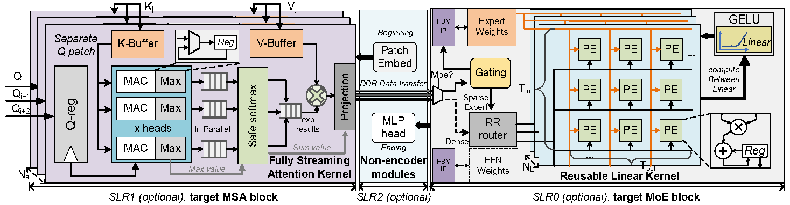
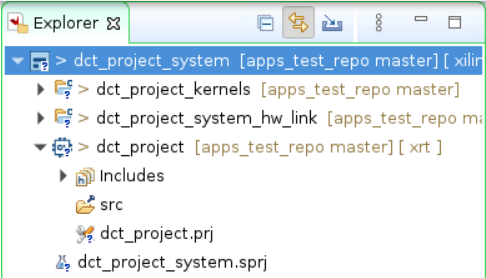

# UbiMoE: a Ubiquitous Mixture-of-Experts Vision Transformer Accelerator with Hybrid Computation Pattern on FPGA

## Environment
- **Ubuntu 20.04**
- **Vitis**, **XRT** (Xilinx Runtime) and **XCU280 platform** 2022.1 [link](https://www.xilinx.com/support/download/index.html/content/xilinx/en/downloadNav/alveo/u280.html) 
- **Model and Dataset** : We use the [$M^3ViT$](https://github.com/VITA-Group/M3ViT) as our model and evaluate on [Cityscape Dataset](https://www.cityscapes-dataset.com/)

## Overview


This repository contains the Xilinx HLS (High Level Synthesis) implementation for the ISCAS2025 paper  *["UbiMoE: a Ubiquitous Mixture-of-Experts Vision Transformer Accelerator with Hybrid Computation Pattern on FPGA"](https://arxiv.org/abs/2502.05602).*

Inspired by the Computation Reordering method in [$M^3ViT$](https://github.com/VITA-Group/M3ViT), UbiMoE focuses on the differing memory access requirements of the attention and FFN components in MoE-ViT to achieve a trade-off between resource utilization and performance. 

In practice, we implement a fully streaming attention kernel optimized for latency and a reusable linear kernel optimized for resource efficiency. Since all the cores are parameterized, they can be easily adapted to different FPGAs.


## Compile and Run
The following steps we use are based on the *Xilinx Vitis Unified IDE*. If needed, the official guidance can be found [here](https://docs.amd.com/r/2022.1-English/ug1393-vitis-application-acceleration/Using-the-Vitis-IDE).

- **Open Vitis tools**：
```shell
source /opt/Xilinx/xrt/setup.sh
source /path/to/vitis/2022.1/settings64.sh
vitis
```

- **Create new projects**:
Select the Application Project with the corresponding board files. After that, you can open the project as follows：


- **Add sources**:
Place the src files in the `project_name_kernels` directory (eg,`dct_project_kernels` in figure), and the testbench files in the `project_name` directory.

- **Set top functions**:
There are three top functons in this project for Running Parallelization, which is `patch_embed`, `ViT_compute` and `fullconnect`. Click on the `.prj` file under the `project_name_kernel` directory to add them into the binary container.

- **Set compile configs**:
 you can also configure the compilation options (SLRs, DDR/HBM) through the `.prj` file under the `project_name_system_hw_link` directory. **Caution**: the input/output and norm buffers we use in testbench are the same for different top functions, please keep ports consistency in configs otherwise error occurs.

- **Build and Run**:
Using `HW` target to bulid the final project. After compiling, In the `HW` directory, locate the generated `.xclbin` file and the executable file. 
```shell
./executable you_project.xclbin
```

