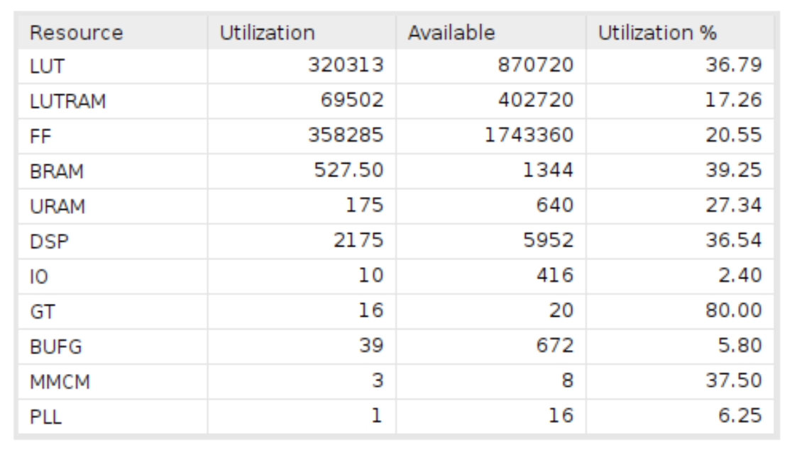
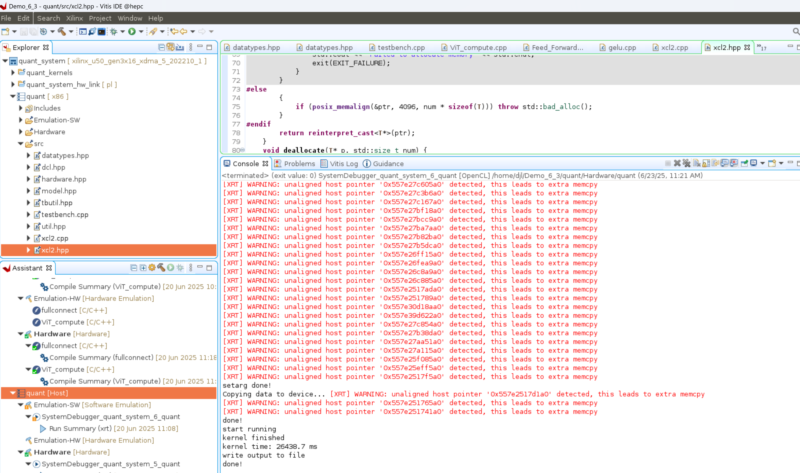

# UbiMoE Accelerator for Vision Transformer (ViT)

## Environment

In addition to the hardware setup described in our original paper, this implementation relies on the following software environment:

- **Ubuntu 20.04**
- **Python 3.9**
- Required Python packages: `numpy`, `torch`, `torchvision`, `tqdm`

## Overview

This repository provides a fixed-point implementation of the UbiMoE accelerator targeting Vision Transformer (ViT) models on the Xilinx Alveo U50 FPGA board. It includes:

- HLS kernel implementations  
- C++ and Python testbenches for functional verification  

Due to file size limitations on GitHub, the `xclbin` and full Vitis project files are hosted on [Google Drive](https://drive.google.com/drive/folders/1mjEzBao_nVqEP6-TPSgq-UBtzXuohayZ?usp=drive_link).

The usage process is similar to that described in the main repository's README and is therefore omitted here.

## Parallel Execution Design

The UbiMoE accelerator is designed to execute the Multi-Head Self-Attention (MSA) and Feed-Forward Network (FFN) modules in parallel. The directory structure and kernel layout are as follows:

```
ViT_Compute/
├── QKV_generation/             # HLS kernels for Q/K/V generation
│   ├── layerNorm_kernel        # Layer normalization
│   ├── linear_kernel1          # Linear layers for Q/K/V projection
│   │                           # <--- Double Buffering Enabled --->
│
├── atten_compute/              # HLS kernels for attention computation
│   ├── attention_kernel        # Scaled dot-product attention
│   ├── linear_kernel2          # Output projection

Feed_Forward/
├── layerNorm_kernel            # Layer normalization
├── linear_kernel1              # First FFN linear transformation
│   │                           # <--- Double Buffering Enabled --->
├── linear_kernel2              # Second FFN linear transformation

# <--- Double buffering enabled via OpenCL command line --->
```

This design enables concurrent execution of MSA and FFN modules. Within each module, kernels are activated in parallel to further enhance throughput. The result is a pipeline architecture that overlaps computation across modules and kernels for improved performance.

## Evaluation

The fixed-point implementation adopts a default activation format of `<16,7>`, specified in `\include\datatypes.hpp`. This denotes a 16-bit value with 7 bits for the integer part and 9 bits for the fractional part. You may modify this precision to meet the requirements of specific models or hardware constraints.

As our Alveo U280 board is currently unavailable, we provide implementation files targeting the U50 board. As the usage of computation resources will greatly influence the compilation and routing process, the demo we provide is a minimal implementation of near 35% of the total computation resources of the U50 board, which is convenient for users to compile and run.

Despite this, the design achieves an average inference latency of **26.4 ms** on the ViT-B/16 model (12 transformer layers), which is approximately **2.2× slower** than the full-performance result reported in our paper.



Thanks to the modular and scalable design, the implementation can be easily scaled up by modifying kernel parameters to utilize more FPGA resources.

## Citation

If you find this implementation useful in your work, please cite our paper:

```bibtex
@inproceedings{dong2025ubimoe,
  title     = {UbiMoE: A Ubiquitous Mixture-of-Experts Vision Transformer Accelerator With Hybrid Computation Pattern on FPGA},
  author    = {Dong, Jiale and Lou, Wenqi and Zheng, Zhendong and Qin, Yunji and Gong, Lei and Wang, Chao and Zhou, Xuehai},
  booktitle = {2025 IEEE International Symposium on Circuits and Systems (ISCAS)},
  pages     = {1--5},
  year      = {2025},
  organization = {IEEE}
}
```
